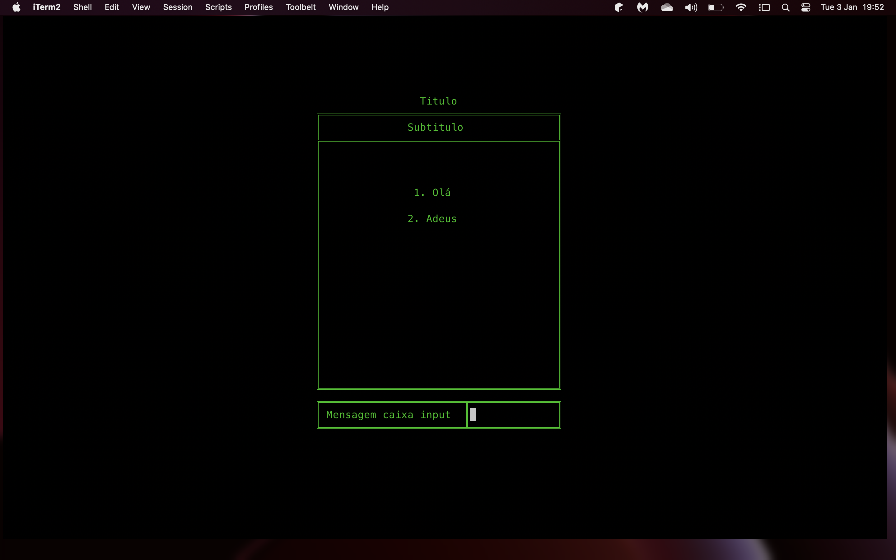
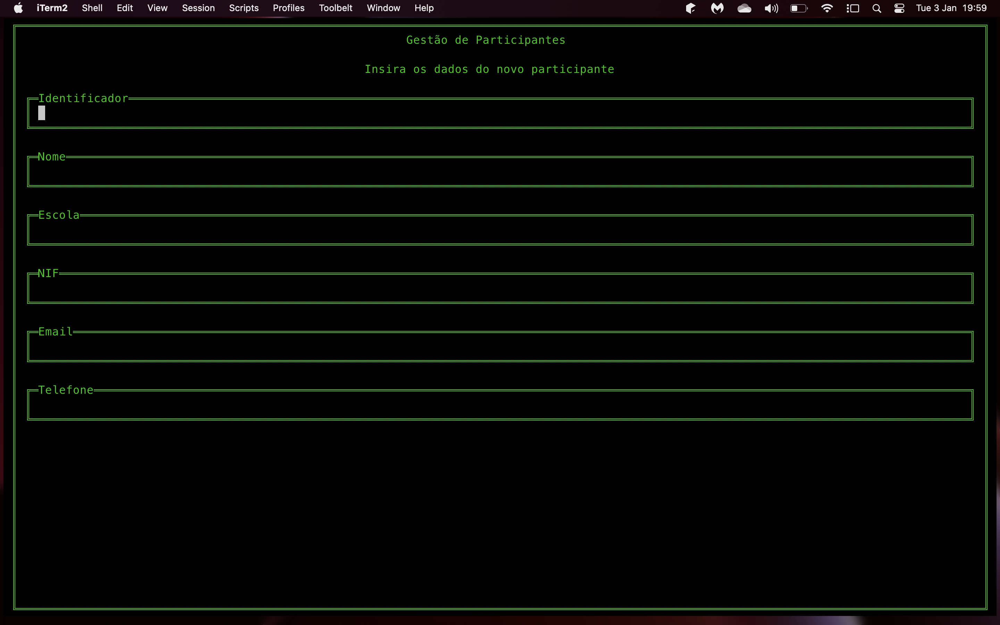
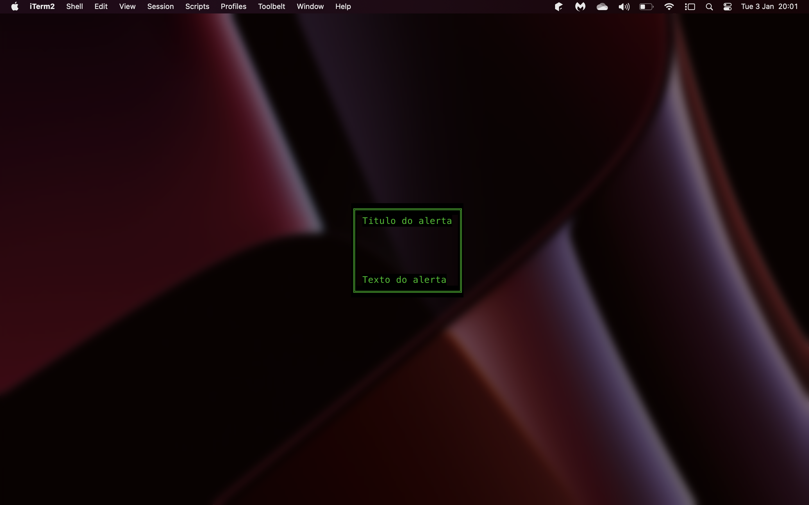

# Biblioteca `CLI.h`

A biblioteca CLI, descrita no ficheiro [cli.h](../include/cli.h), oferece uma interface simples e completa para a leitura e escrita de dados na _stdout_/_stdin_.

> __Aviso__: devido a problemas de compatibilidade com o Windows, a biblioteca CLI apenas utiliza caracteres ASCII para desenhar os formulários e menus. A versão para Linux e MacOS utiliza caracteres Unicode.

## Funcionalidades

- Criação automática de menus;
- Criação automática de formulários;
- Ações rápidas (como prompts e alertas);
- Formatação de texto;

### Menus

```c
typedef struct {               
    char*  titulo;             
    char*  subtitulo;          
    char** opcoes;             
    int    numero_opcoes;      
    char*  mensagem;           
    char*  mensagem_erro;      
    int    largura;            
    int    altura;             
    int    posicao_x;          
    int    posicao_y;          
    int    auto_ajustar;       
    char*  cor_letras;         
    char*  cor_fundo;          
    int    pintar_consola;
} t_menu;
```

A estrutura dos menus facilita a criação, desenho e leitura de menus, centrando o conteúdo automáticamente no centro da linha de comandos tendo em conta o tamanho da consola.

As dimensões do menu devem ser passadas manualmente, porém é possivel ativar o modo de auto-ajuste através da flag `auto_ajustar`. Neste modo, se o conteúdo dentro do menu exceder as dimenções definidas, o menu é redimensionado automaticamente.

#### Funções - Menus

```c
t_menu* criar_menu(char*, char*, char**, int, char*, char*, int, int, int, char*, char*, int);
void desenhar_menu(t_menu*);
int  ler_opcao_menu(t_menu*);
```


#### Exemplo de utilização - Menu

```c
#include <stdio.h>
#include "cli.h"

typedef enum {
      OPCAO1 = 0,
      OPCAO2
} t_opcao_menu


int main() {
      t_menu *menu;
      t_opcao_menu opcao;

      char* opcoes_menu[] = {"1. Olá", "2. Adeus"};
      int   altura_menu = 20;
      int   largura_menu = 40;
      int   auto_ajustar = 1, pintar_consola = 1;

      menu = criar_menu("Titulo", "Subtitulo", opcoes_menu, 2, "Mensagem caixa input", "Mensagem de erro", largura_menu, altura_menu, auto_ajustar, COR_TEXTO_VERDE, COR_FUNDO_PRETO, pintar_consola);

      desenhar_menu(menu);
      opcao = ler_opcao_menu(menu);

      switch(opcao) {
            case OPCAO1:
                  printf("Olá\n");
                  break;
            case OPCAO2:
                  printf("Adeus\n");
                  break;
      }

      return 0;
}
```

#### Resultado



### Formulários

```c
typedef struct {
    char*  titulo;
    char*  subtitulo;
    char** rotulos;
    int    numero_campos;
    void*  estrutura_output;
    t_tipo_estrutura tipo_estrutura_output;
} t_formulario_input;
```

Esta estrutura permite a criação automática de formulários para a leitura de estruturas de dados específicas, como é o caso dos participantes, atividades e inscrições.

Os formulários fazem verificações automáticas de acordo com os campos e o tipo de dados escolhido.
A estrutura de output (onde os dados lidos no formulário deverão ser guardados) deve ser passada sob a forma de um ponteiro e o tipo de dados da estrutura deve ser especificado através de uma das opções definidas na enumeração `t_tipo_estrutura` (ficheiro [comum.h](../include/comum.h)).

#### Funções - Formulários

```c
t_formulario_input* criar_formulario_input(char*, char*, char**, int, void*, t_tipo_estrutura);
void desenhar_formulario_input(t_formulario_input*);
int  ler_formulario_input(t_formulario_input*, t_estado_programa*);
```

#### Exemplo de utilização - Formulário

```c
#include <stdio.h>
#include "cli.h"

int main() {
      t_formulario_input* formulario;
      char* campos_formulario[] = {"Identificador", "Nome","Escola","NIF","Email","Telefone"};
      t_participante* participante;

      formulario = criar_formulario_input("Titulo", "Subtitulo", campos_formulario, 6, &participante, PARTICIPANTE);
      desenhar_formulario_input(formulario_participante);
      ler_formulario_input(formulario_participante, estado_programa);

      mostrar_participante(participante);

      return 0;
}
```

#### Resultado



### Ações rápidas

A biblioteca CLI contém algumas ações rápidas e funções utilitárias para interagir com a _stdin_/_stdout_. Estas funções podem ser utilizadas para informar o utilizador sobre alguma coisa, ou para requisitar a introdução de dados primitivos de forma controlada.

#### Funções - Ações rápidas

```c
void prompt(char*, char*, char*, void*, t_tipo_primitivo, char*, char*);
void alerta(char*, char*, char*, char*); 
```

#### Exemplo de utilização - Ações rápidas

```c
#include <stdio.h>
#include "cli.h"

int main() {
      int numero;

      // Mostra um alerta centrado na consola e espera que o utilizador pressione uma tecla para continuar
      alerta("Titulo do alerta", "Texto do alerta", COR_TEXTO_VERDE, COR_FUNDO_PRETO);

      // Mostra um prompt centrado na consola e espera que o utilizador introduza um inteiro
      prompt("Titulo da Mensagem", "Texto da Mensagem", "Dica", &numero, T_INT, COR_TEXTO_VERDE, COR_FUNDO_PRETO);

      return 0;
}
```

#### Resultado


<hr>
